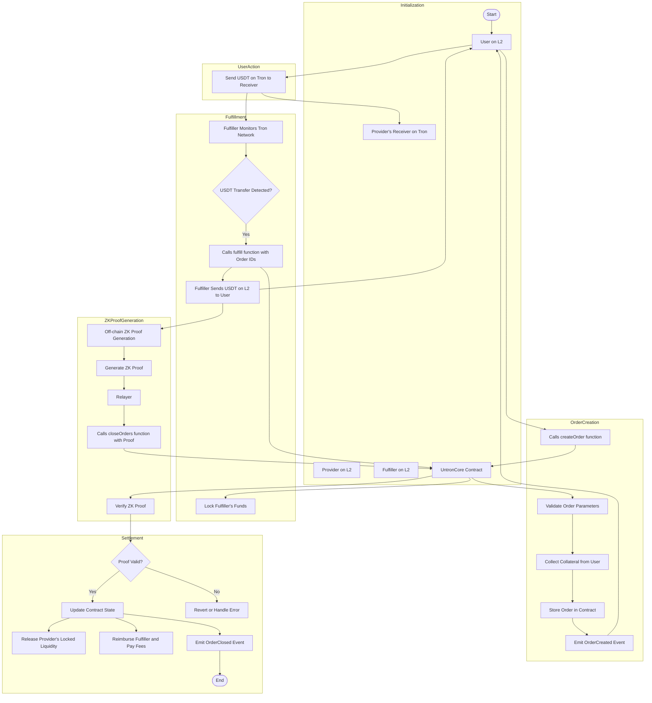

# [Untron](https://untron.finance) V1

Smart contracts for Untron V1 protocol

## High-level overview

Untron V1 is a B2B P2P marketplace for exchanging USDT on Tron Network into USDT on ZKsync Era, [inspired by ZKP2P](https://zkp2p.xyz). It has a native [LI.FI](https://li.fi) integration, allowing to automatically swap USDT on Era into any other token on any Ethereum L2 and more. Ethereum-based projects, such as wallets, who are willing to enable USDT Tron deposits, can integrate Untron V1 and create orders on behalf of their users.

Untron V1 is the first protocol of the two, along with [Untron Intents](https://github.com/ultrasoundlabs/untron-intents), forming the larger [Untron project](https://untron.finance). It's described in high level in ["P2P ZK Light Client Bridge between Tron and Ethereum L2s" (Hook, 2024)](https://ethresear.ch/t/p2p-zk-light-client-bridge-between-tron-and-ethereum-l2s/19931).

All Untron protocols are powered by [Untron ZK Engine](https://github.com/ultrasoundlabs/untron)—a Rust program implementing a minimal Tron node with an internal state used by the protocols. It's compiled and executed using SP1 zkVM to generate ZK proofs of Tron blockchain and all necessary deposits and transfers.

## Integrate

For integration, please proceed to [our documentation](https://ultrasoundlabs.github.io/untron-docs). You can also contact us at [contact@untron.finance](mailto:contact@untron.finance).

## License

Untron project and all protocols it consists of are licensed under BUSL license by Ultrasound Labs LLC. For more details, please refer to [LICENSE](/LICENSE). Some of the project's dependencies are licensed under MIT and Apache-2.0 licenses.
